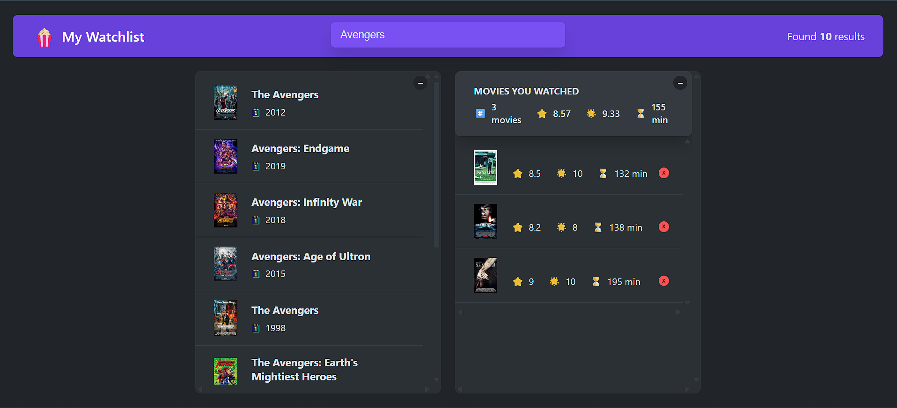

# 🍿 My Watchlist App

**"My Watchlist"** is a sleek and intuitive React application that helps you discover new movies and track what you've already watched. Powered by the OMDB API, it lets you search for movies, view detailed info, add them to your watched list, and rate them — all with a clean and modern interface.

---
## 🔍 Preview
- Live - https://dipan46.github.io/my-watchList-app/

## ✨ Features

- 🎬 **Movie Search** – Search movies by title using the OMDB API
- 🔍 **Detailed View** – Click a movie to view plot, cast, director, runtime, IMDB rating, etc.
- ✅ **Watched List** – Add movies you've watched to a dedicated list
- 🌟 **Custom Rating** – Rate watched movies (1–10 stars)
- 📊 **Watched Summary** – See stats: average IMDB rating, your rating average, total runtime
- 🗑️ **Remove Watched** – Remove movies from the watched list
- 💾 **Local Storage** – Your list persists after closing the browser
- ⌨️ **Keyboard Shortcuts**:
  - Press `ESC` to close movie details
  - Press `Enter` to focus the search bar
- 🧱 **Component-Based Architecture** – Clean, modular, and scalable structure
- 🧩 **Custom Hooks** – Reusable hooks for movies, local storage, and keyboard handling

---

## 🛠️ Technologies Used

- **React** – JavaScript library for building UIs
- **HTML & CSS** – For layout and styling
- **JavaScript (ES6+)** – App logic
- **OMDB API** – Movie data source

---

## 📸 Preview

_Example UI of the app in action:_



---

## 🚀 Getting Started

### Prerequisites

- [Node.js](https://nodejs.org/) (comes with `npm`)

### Installation

1. **Clone the repository**:

   ```bash
   git clone https://github.com/Dipan46/my-watchlist-app.git
   cd my-watchlist-app

2. **Install dependencies**:

   ```bash
   npm install
   ```

3. **Add OMDB API Key**:

   * Get a free key from [OMDB API](http://www.omdbapi.com/apikey.aspx)
   * Replace all instances of:

     ```js
     const KEY = "Your_Key;
     ```

     with your actual key in the following files:

     * `App.jsx`
     * `MovieDetails.jsx`
     * `useMovies.js` (if used)

4. **Start the development server**:

   ```bash
   npm run dev
   ```

   Visit [http://localhost:5173](http://localhost:5173) in your browser.

---

## 📂 Project Structure

```
src/
├── App.css
├── App.jsx
├── components/
│   ├── Box.jsx
│   ├── ErrorMessage.jsx
│   ├── Loader.jsx
|   ├── StarRating.jsx
│   ├── Main.jsx
│   ├── Movie.jsx
│   ├── MovieDetails.jsx
│   ├── MovieList.jsx
│   ├── Navbar/
│   │   ├── Navbar.jsx
│   │   ├── Logo.jsx
│   │   ├── NumResults.jsx
│   │   └── Search.jsx
│   ├── WatchedMovie.jsx
│   ├── WatchedMovieList.jsx
│   └── WatchedSummary.jsx
├── customHooks/
│   ├── useKey.js
│   ├── useLocalStorageState.js
│   └── useMovies.js
└── main.jsx
```

---

## 💡 Learnings & Concepts Demonstrated

* 🧠 **State Management** with `useState`
* 🌐 **Side Effects** with `useEffect`
* 🛠 **Custom Hooks** for modular and reusable logic
* 🧩 **Component Composition** for scalable UI
* 🧬 **Props Handling** and state lifting
* 👁️ **Conditional Rendering**
* 🖱 **Event Handling** and keyboard shortcuts
* 📌 **Refs with useRef** for DOM access
* 💾 **LocalStorage Integration**
* 🧯 **Error Handling** and UI feedback
* 🚀 **Performance Optimizations** with debouncing and effect dependencies

---

## 🤝 Contributing

Feel free to fork this repo, make changes, and submit pull requests. All contributions are appreciated and welcome!

---

## 📄 License

This project is open source and available under the [MIT License](LICENSE).

---

## 👨‍💻 Author

Made with ❤️ by [Dipan46](https://github.com/Dipan46)


